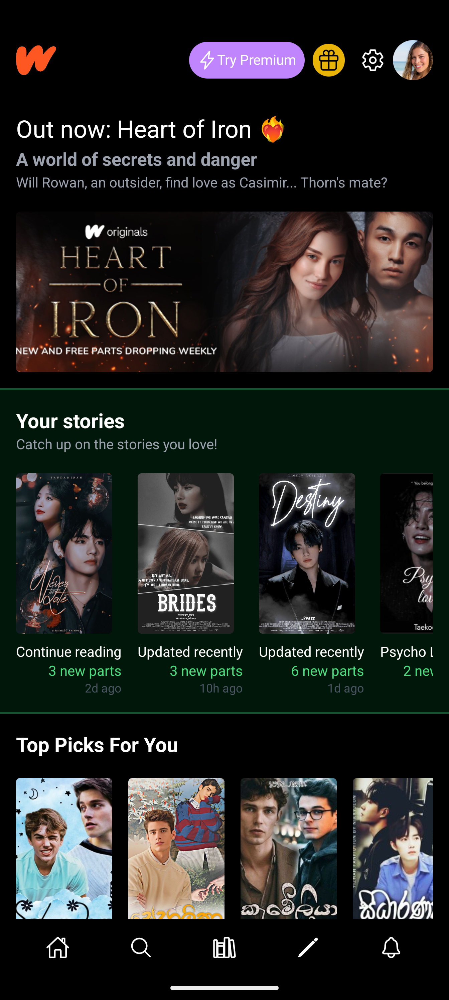
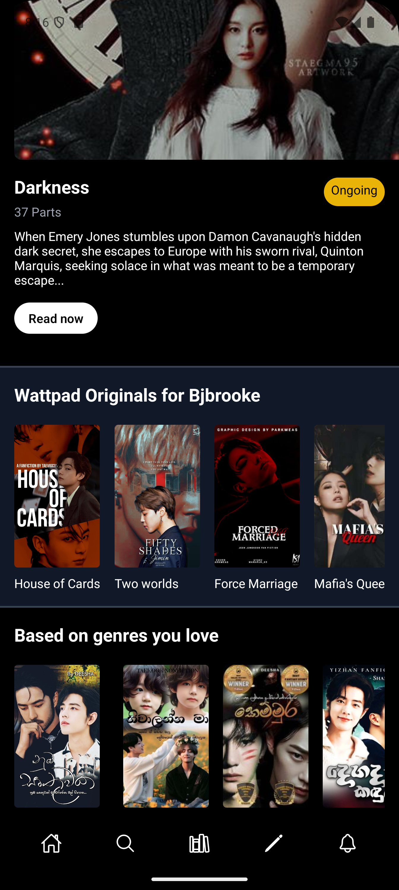
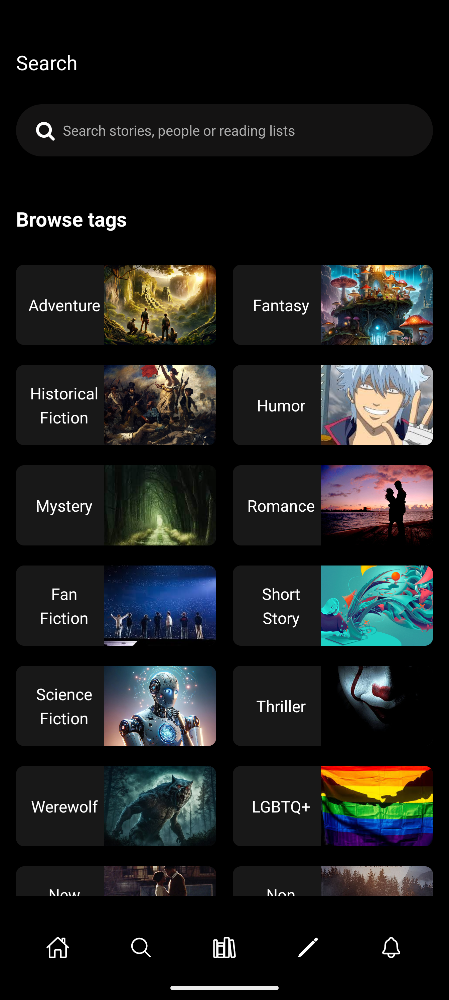
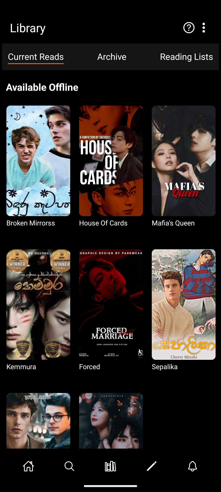
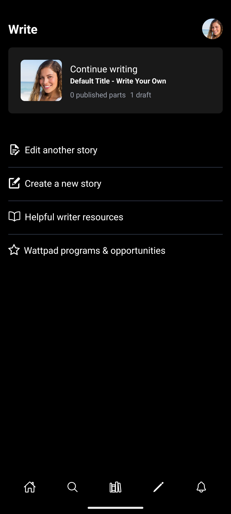
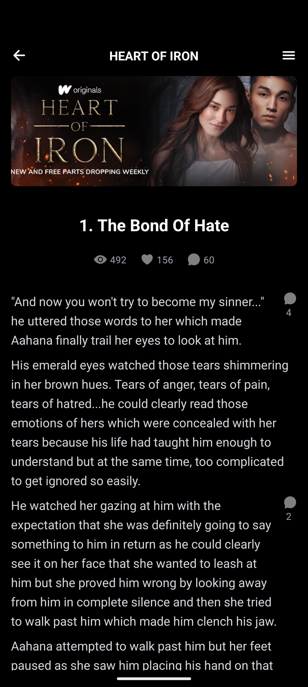
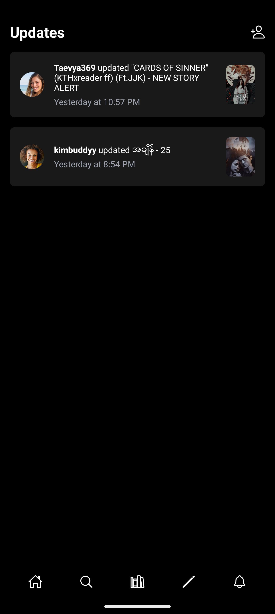

# Welcome to the Wattpad Clone Repository! 📚📱

This mobile application is designed to emulate the core features of Wattpad, enabling users to read, write, and share stories. Built using React Native, this app aims to provide a seamless and engaging reading and writing experience on mobile devices.

## Technology stack
Frontend
✅ React Native

## Key Features:
- Story Browsing: Explore a vast collection of stories across various genres.
- Story Creation: Write and publish your own stories with ease.
- Personal Library: Save your favorite stories and manage your reading list.
- Interactive Reading: Engage with stories through comments, likes, and more.
- User Profiles: Customize your profile, follow other users, and stay updated with their latest stories.

Feel free to explore the code, contribute, and share your feedback to help improve the application!
- Login Page

- Dashboard

- 

- Search Page

- Library Page

- Writing Page

- Story Page

- Notification Page

